# Лабораторная работа №1 (Проект Эйлера)

---

* Студент: `Разинкин Александр Владимирович`
* Группа: `P3307`
* ИСУ: `368712`
* Функциональный язык: `Elixir`

--- 

## Проблема №15

---

* Название: `Lattice Paths`
* Описание: `Starting in the top left corner of a  grid, and only being able to move to the right and down, 
there are exactly  routes to the bottom right corner.`
* Задание: `How many such routes are there through a 20x20 grid?`

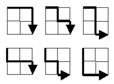

---

### Основная идея решения

Ответ к данной задаче можно получить при помощи следующего выражения:

$$\frac{(2 \cdot n)!}{n! \cdot n!}$$

Где n - размерность сетки.

Т.е. для получения ответа на Elixir нам требуется реализовать вычисление факториала.

--- 

### Решение через рекурсию

```elixir
defmodule Task15.Recursion do
  @moduledoc "Realization by using recursion"

  defp factorial(1), do: 1

  defp factorial(n) when is_integer(n) and n > 1, do: n * factorial(n - 1)

  @spec solution(pos_integer()) :: integer()
  def solution(grid_size) when is_integer(grid_size) and grid_size > 0 do
    trunc(factorial(2 * grid_size) / (factorial(grid_size) * factorial(grid_size)))
  end
end
```

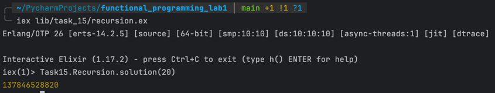

### Решение через хвостовую рекурсию 

```elixir
defmodule Task15.TailRecursion do
  @moduledoc "Realization by using tail recursion"

  defp factorial(n) when is_integer(n) and n > 1, do: factorial(n, 1)

  defp factorial(1, acc), do: acc

  defp factorial(n, acc) when is_integer(n) and n > 1, do: factorial(n - 1, n * acc)

  @spec solution(pos_integer()) :: integer()
  def solution(grid_size) when is_integer(grid_size) and grid_size > 0,
    do: trunc(factorial(2 * grid_size) / (factorial(grid_size) * factorial(grid_size)))
end
```

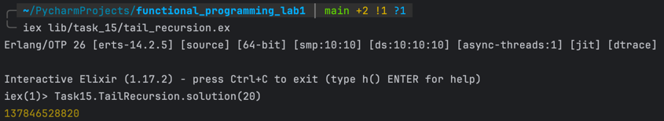

### Решение через модульность (reduce, filter, map)

```elixir
defmodule Task15.Modular do
  @moduledoc "Realization by using modules (generate, filter, reduce + map)"

  defmodule SequenceGenerator do
    @moduledoc "Module-generator"

    @spec generate_sequence(pos_integer()) :: Range.t()
    def generate_sequence(n) when is_integer(n) and n > 1, do: 1..n
  end

  defmodule SequenceFilter do
    @moduledoc "Module-filter"

    @spec filter_sequence(any()) :: list()
    def filter_sequence(sequence), do: Enum.filter(sequence, &is_integer/1)
  end

  defmodule SequenceMapper do
    @moduledoc "Module-mapper"

    @spec map_sequence(any()) :: list()
    def map_sequence(sequence), do: Enum.map(sequence, & &1)
  end

  defmodule SequnceReducer do
    @moduledoc "Module-reducer"

    @spec factorial(any()) :: any()
    def factorial(integer_sequence), do: Enum.reduce(integer_sequence, 1, &(&1 * &2))
  end

  @spec solution(pos_integer()) :: integer()
  def solution(grid_size) when is_integer(grid_size) and grid_size > 0 do
    factorial =
      &(SequenceGenerator.generate_sequence(&1)
        |> SequenceMapper.map_sequence()
        |> SequenceFilter.filter_sequence()
        |> SequnceReducer.factorial())

    trunc(factorial.(2 * grid_size) / (factorial.(grid_size) * factorial.(grid_size)))
  end
end
```

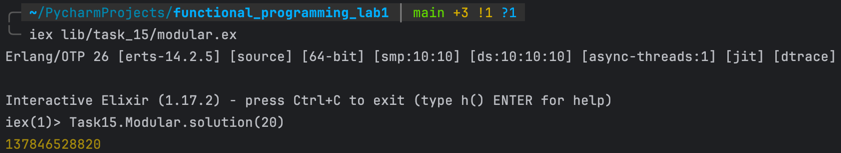

### Решение через бесконечные структуры и ленивые исполнения (Stream)

```elixir
defmodule Task15.Lazy do
  @moduledoc "Realization by using lasy components"

  @spec factorial(integer()) :: integer()
  defp factorial(n) when is_integer(n) and n > 0,
    do:
      Stream.iterate(1, &(&1 + 1))
      |> Stream.take(n)
      |> Enum.reduce(1, &(&1 * &2))

  @spec solution(integer()) :: integer()
  def solution(grid_size) when is_integer(grid_size) and grid_size > 0 do
    trunc(factorial(2 * grid_size) / (factorial(grid_size) * factorial(grid_size)))
  end
end
```

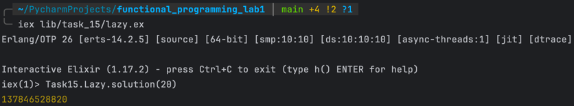

### Решение через императивный язык (Go)

```golang
package main

import (
	"fmt"
	"math/big"
)

func factorial(n int64) *big.Int {
	result := big.NewInt(1)
	current := big.NewInt(1)

	for i := int64(2); i <= n; i++ {
		current.SetInt64(i)
		result.Mul(result, current)
	}

	return result
}

func main() {
	var gridSize int64
	_, err := fmt.Scan(&gridSize)

	if err != nil || gridSize <= 0 {
		fmt.Println("Error")
		return
	}

	result := big.NewInt(0);
	result.Add(result, factorial(2 * gridSize))
	result.Div(result, factorial(gridSize))
	result.Div(result, factorial(gridSize))

	fmt.Println(result)
}
```

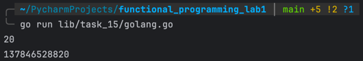

---

## Проблема №16

---

* Название: `Power Digit Sum`
* Описание: `2^15 = 32768 and the sum of its digits is 3 + 2 + 7 + 6 + 8 = 26`
* Задание: `What is the sum of the digits of the number 2^1000?`

---

### Основная идея решения

Благодаря возможности использовать большие целые числа в Elixir решение данной проблемы сводится 
к преобразованию исходного числа в последовательность его цифр и дальнейшее их суммирование. 

Если более подробно: будем делить число на 10 вплоть до его обнуления и складывать остатки, получающиеся 
на каждой итерации.

---

### Решение через рекурсию

```elixir
defmodule Task16.Recursion do
  @moduledoc "Realization by using recursion"

  defp calculate(0), do: 0

  defp calculate(num) when is_integer(num) and num > 0, do: rem(num, 10) + calculate(div(num, 10))

  @spec solution(non_neg_integer()) :: non_neg_integer()
  def solution(pow) when is_integer(pow) and pow > 0, do: calculate(trunc(:math.pow(2, pow)))
end
```

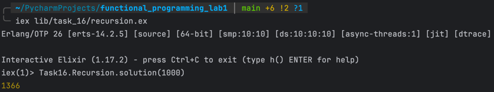

### Решение через хвостовую рекурсию

```elixir
defmodule Task16.TailRecursion do
  @moduledoc "Realization by using tail recursion"

  defp calculate(0, acc), do: acc

  defp calculate(num, acc) when is_integer(num) and num > 0, do: calculate(div(num, 10), acc + rem(num, 10))

  @spec solution(integer()) :: integer()
  def solution(pow) when is_integer(pow) and pow > 0, do: calculate(trunc(:math.pow(2, pow)), 0)
end
```

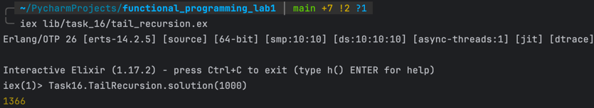

### Решение через модульность (reduce, filter, map)

```elixir
defmodule Task16.Modular do
  @moduledoc "Realization by using modules (generate, filter, reduce + map)"

  defmodule SequenceGenerator do
    @moduledoc "Module-generator"

    @spec generate_sequence(integer()) :: list()
    def generate_sequence(num) when is_integer(num) and num > 0, do: generate_sequence(num, [])

    defp generate_sequence(0, acc), do: acc

    defp generate_sequence(num, acc) when is_integer(num) and num > 0, do: generate_sequence(div(num, 10), [rem(num, 10) | acc])
  end

  defmodule SequenceFilter do
    @moduledoc "Module-filter"

    @spec filter_sequence(list()) :: list()
    def filter_sequence(sequence), do: Enum.filter(sequence, &is_integer/1)
  end

  defmodule SequenceMapper do
    @moduledoc "Module-mapper"

    @spec map_sequence(list()) :: list()
    def map_sequence(sequence), do: Enum.map(sequence, & &1)
  end

  defmodule SequenceReducer do
    @moduledoc "Module-reducer"

    @spec reduce_sequence(list()) :: integer()
    def reduce_sequence(integer_sequence), do: Enum.reduce(integer_sequence, 0, &(&1 + &2))
  end

  @spec solution(integer()) :: integer()
  def solution(pow) when is_integer(pow) and pow > 0 do
    SequenceGenerator.generate_sequence(trunc(:math.pow(2, pow)))
    |> SequenceFilter.filter_sequence()
    |> SequenceMapper.map_sequence()
    |> SequenceReducer.reduce_sequence()
  end
end
```

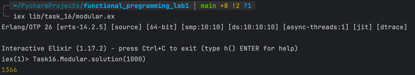

### Решение через бесконечные структуры и ленивые исполнения (Stream)

```elixir
defmodule Task16.Lazy do
  @moduledoc "Realization by using lasy components"

  def solution(pow) when is_integer(pow) and pow > 0 do
    Stream.iterate(trunc(:math.pow(2, pow)), &div(&1, 10))
    |> Stream.take(pow)
    |> Stream.map(&rem(&1, 10))
    |> Enum.reduce(0, &(&1 + &2))
  end
end
```

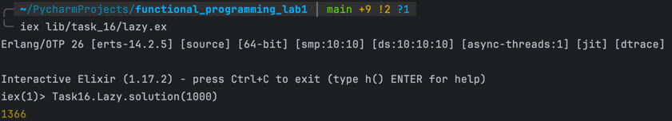

### Решение через императивный язык (Go)

```golang
package main

import (
	"fmt"
	"math/big"
)

func solution(number *big.Int) *big.Int {
	sum := big.NewInt(0)
	temp := big.NewInt(0)
	base := big.NewInt(10)

	for number.Cmp(big.NewInt(0)) != 0 {
		temp.Set(number)
		sum.Add(sum, temp.Mod(temp, base))
		number.Div(number, base)
	}

	return sum
}

func main() {
	var pow int64
	_, err := fmt.Scan(&pow)

	if err != nil || pow <= 0 {
		fmt.Println("Error")
		return
	}

	number := big.NewInt(2)
	number.Exp(number, big.NewInt(pow), nil)

	fmt.Println(solution(number))
}
```

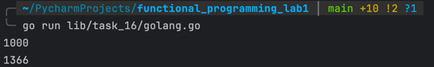

--- 

## Выводы

В ходе решения задач я применил классические приемы, присущие функциональным языкам:

- Рекурсия - для реализации циклов
- Pattern Matching (сопоставление с образцом) - для реализации ветвления 
(ну и, само собой, для привязывания значения переменных)

В обеих проблемах меня выручило классное свойство целых чисел в Elixir - их нефиксированный размер, т.е. 
возможность занимать бесконечно большое число байтов (например, выражение (2 * 20)! 
не поместилось в int64 языка Go - пришлось использовать стандартную библиотеку math/big).

Практика показала, что функциональные языки в зависимости от предлагаемой задачи 
являются более удобным вариантом по сравнению с традиционными императивными языками программирования.
