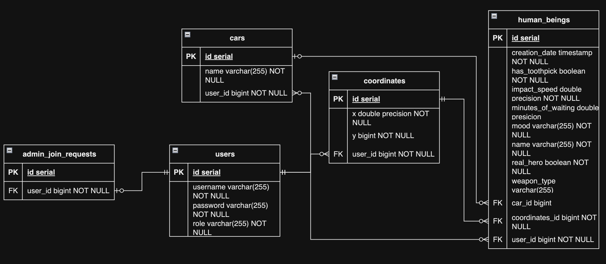

# Лабораторная работа №1 по дисциплине "Информационные Системы"

---

* Студент: `Разинкин Александр Владимирович`
* Группа: `P3307`
* ИСУ: `368712`
* Вариант: `14612`

--- 

## Текст задания (было лень редактировать)

Реализовать информационную систему, которая позволяет взаимодействовать с объектами класса HumanBeing, описание которого приведено ниже:

```java
public class HumanBeing {
private int id; //Значение поля должно быть больше 0, Значение этого поля должно быть уникальным, Значение этого поля должно генерироваться автоматически
private String name; //Поле не может быть null, Строка не может быть пустой
private Coordinates coordinates; //Поле не может быть null
private java.time.LocalDateTime creationDate; //Поле не может быть null, Значение этого поля должно генерироваться автоматически
private Boolean realHero; //Поле не может быть null
private boolean hasToothpick;
private Car car; //Поле не может быть null
private Mood mood; //Поле не может быть null
private double impactSpeed;
private Integer minutesOfWaiting; //Поле может быть null
private WeaponType weaponType; //Поле может быть null
}
public class Coordinates {
private float x; //Максимальное значение поля: 647
private int y; //Максимальное значение поля: 123
}
public class Car {
private String name; //Поле не может быть null
}
public enum Mood {
SADNESS,
SORROW,
APATHY,
CALM,
FRENZY;
}
public enum WeaponType {
HAMMER,
AXE,
SHOTGUN,
RIFLE,
BAT;
}
```

Разработанная система должна удовлетворять следующим требованиям:

    Основное назначение информационной системы - управление объектами, созданными на основе заданного в варианте класса.
    Необходимо, чтобы с помощью системы можно было выполнить следующие операции с объектами: создание нового объекта, получение информации об объекте по ИД, обновление объекта (модификация его атрибутов), удаление объекта. Операции должны осуществляться в отдельных окнах (интерфейсах) приложения.При получении информации об объекте класса должна также выводиться информация о связанных с ним объектах.
    При создании объекта класса необходимо дать пользователю возможность связать новый объект с объектами вспомогательных классов, которые могут быть связаны с созданным объектом и уже есть в системе.
    Выполнение операций по управлению объектами должно осуществляться на серверной части (не на клиенте), изменения должны синхронизироваться с базой данных.
    На главном экране системы должен выводиться список текущих объетов в виде таблицы (каждый атрибут объекта - отдельная колонка в таблице). При отображении таблицы должна использоваться пагинация (если все объекты не помещаются на одном экране).
    Нужно обеспечить возможность фильтровать/сортировать строки таблицы, которые показывают объекты (по значениям любой из строковых колонок). Фильтрация элементов должна производиться по неполному совпадению.
    Переход к обновлению (модификации) объекта должен быть возможен из таблицы с общим списком объектов и из области с визуализацией объекта (при ее реализации).
    При добавлении/удалении/изменении объекта, он должен автоматически появиться/исчезнуть/измениться в интерфейсах у других пользователей, авторизованных в системе.
    Если при удалении объекта с ним связан другой объект, связанные объекты должны удаляться.
    Пользователю системы должен быть предоставлен интерфейс для авторизации/регистрации нового пользователя. У каждого пользователя должен быть один пароль. Требования к паролю: пароль должен быть содержать не менее n символов. В системе предполагается использование следующих видов пользователей (ролей):незарегистрированные пользователи,обычные пользователи и администраторы. Если в системе уже создан хотя бы один администратор, зарегистрировать нового администратора можно только при одобрении одним из существующих администраторов (у администратора должен быть реализован интерфейс со списком заявок и возможностью их одобрения).
    Редактировать и удалять объекты могут только пользователи, которые их создали, и администраторы (администраторы могут редактировать и удалять все объекты).
    Зарегистрированные пользователи должны иметь возможность просмотра всех объектов, но модифицировать (обновлять) могут только принадлежащие им (объект принадлежит пользователю, если он его создал). Для модификации объекта должно открываться отдельное диалоговое окно. При вводе некорректных значений в поля объекта должны появляться информативные сообщения о соответствующих ошибках.

В системе должен быть реализован отдельный пользовательский интерфейс для выполнения специальных операций над объектами:

    Удалить все объекты, значение поля impactSpeed которого эквивалентно заданному.
    Вернуть один (любой) объект, значение поля minutesOfWaiting которого является максимальным.
    Вернуть массив объектов, значение поля minutesOfWaiting которых меньше заданного.
    Удалить всех героев без зубочисток.
    Пересадить всех героев, не имеющих автомобиля на красные "Lada Kalina".

Представленные операции должны быть реализованы в рамках компонентов бизнес-логики приложения без прямого использования функций и процедур БД.

Особенности хранения объектов, которые должны быть реализованы в системе:

    Организовать хранение данных об объектах в реляционной СУБД (PostgreSQL). Каждый объект, с которым работает ИС, должен быть сохранен в базе данных.
    Все требования к полям класса (указанные в виде комментариев к описанию классов) должны быть выполнены на уровне ORM и БД.
    Для генерации поля id использовать средства базы данных.
    Пароли при хранении хэшировать алгоритмом SHA-512.
    При хранении объектов сохранять информацию о пользователе, который создал этот объект, а также фиксировать даты и пользователей, которые обновляли и изменяли объекты. Для хранения информации о пользователях и об изменениях объектов нужно продумать и реализовать соответствующие таблицы.
    Таблицы БД, не отображающие заданные классы объектов, должны содержать необходимые связи с другими таблицами и соответствовать 3НФ.
    Для подключения к БД на кафедральном сервере использовать хост pg, имя базы данных - studs, имя пользователя/пароль совпадают с таковыми для подключения к серверу.

При создании системы нужно учитывать следующие особенности организации взаимодействия с пользователем:

    Система должна реагировать на некорректный пользовательский ввод, ограничивая ввод недопустимых значений и информируя пользователей о причине ошибки.
    Переходы между различными логически обособленными частями системы должны осуществляться с помощью меню.
    Во всех интерфейсах системы должно быть реализовано отображение информации о текущем пользователе (кто авторизован) и предоставляться возможность изменить текущего пользователя.
    [Опциональное задание - +2 балл] В отдельном окне ИС должна осуществляться визуализация объектов коллекции. При визуализации использовать данные о координатах и размерах объекта. Объекты от разных пользователей должны быть нарисованы разными цветами. При нажатии на объект должна выводиться информация об этом объекте.
    При добавлении/удалении/изменении объекта, он должен автоматически появиться/исчезнуть/измениться на области у всех других клиентов.

При разработке ИС должны учитываться следующие требования:

    В качестве основы для реализации ИС необходимо использовать Spring MVC.
    Для создания уровня хранения необходимо использовать EclipseLink.
    Разные уровни приложения должны быть отделены друг от друга, разные логические части ИС должны находиться в отдельных компонентах.

Содержание отчёта:

    Текст задания.
    UML-диаграммы классов и пакетов разработанного приложения.
    Исходный код системы или ссылка на репозиторий с исходным кодом.
    Выводы по работе.

Вопросы к защите лабораторной работы:

    Шаблоны проектирования и архитектурные шаблоны.
    Платформа Jakarta EE. Виды компонентов.
    Jakarta EE. Управляемые бины. CDI-бины.
    Концепция ORM. Библиотеки ORM Hibernate и EclipseLink. Особенности, API, сходства и отличия.
    Технология Jakarta Persistence. Особенности, API, интеграция с ORM-провайдерами.
    Технология Jakarta Data.
    Платформа Spring. Сходства и отличия с Java EE.
    Spring Boot.
    Spring Data.

---

## Схема базы данных (3нф)

